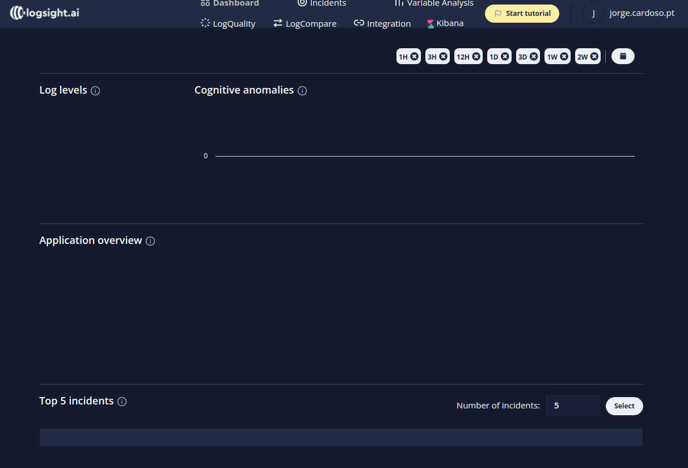
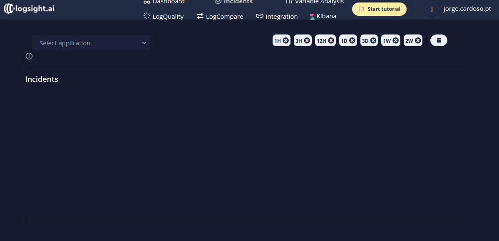

24/09/2021, 5 minutes to read

Look and Feel
*************

Over the past year, the logsight.ai design and engineering teams have been busy developing
a new user experience for our AI-driven log analytics platform.
The platform has a new sleek look and feel as of today.

Dashboard
*********

Incidents
*********

Next is our real-time incident detector which can be accessed in the left control of the menu bar.

Variable Analysis
*********

.. image:: images/variable_analysis.png
  :width: 800
  :alt: Alternative text

log Quality
***********

.. image:: images/log_quality.png
  :width: 800
  :alt: Alternative text

Log Compare
***********

User Management
***************

We’ve added new user management screens so it’s simple to manage users.
In the coming months we'll add new tabs for governance.

.. image:: images/user_management.png
  :width: 800
  :alt: Alternative text

Kibana
******

.. image:: images/kibana.png
  :width: 800
  :alt: Alternative text